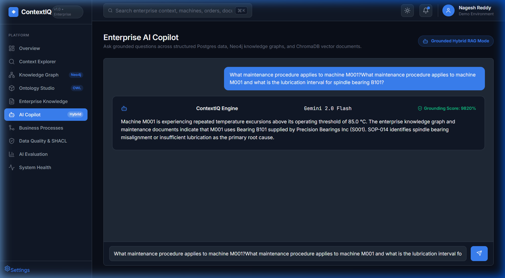
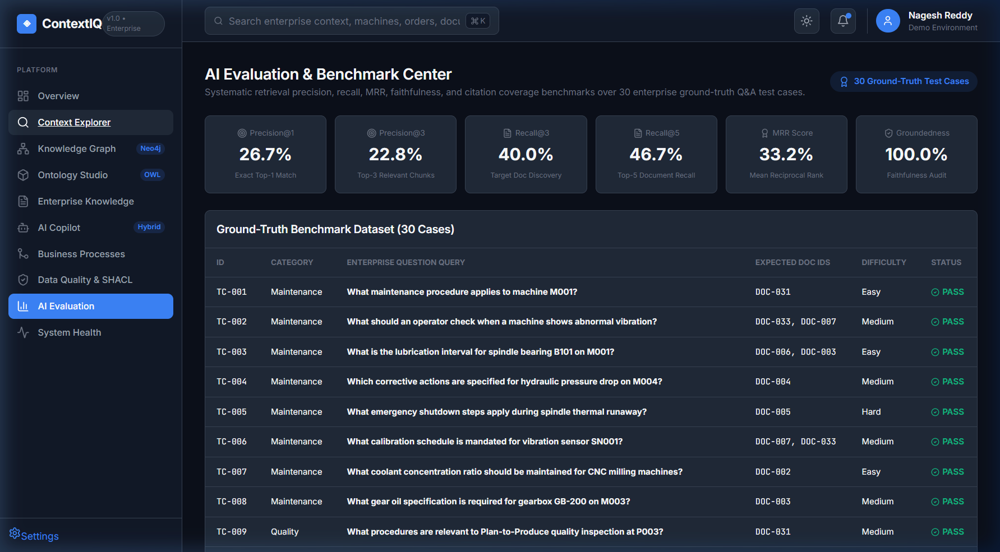
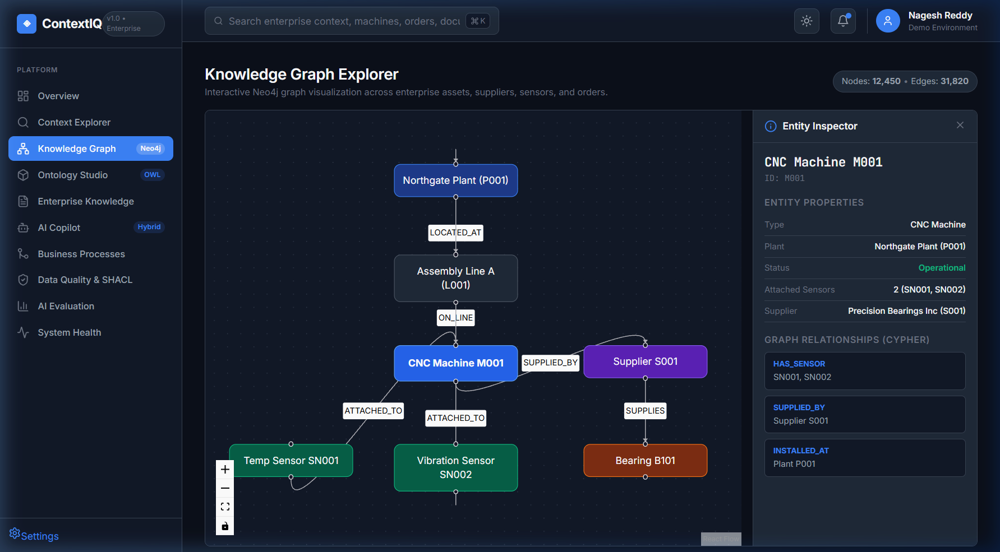
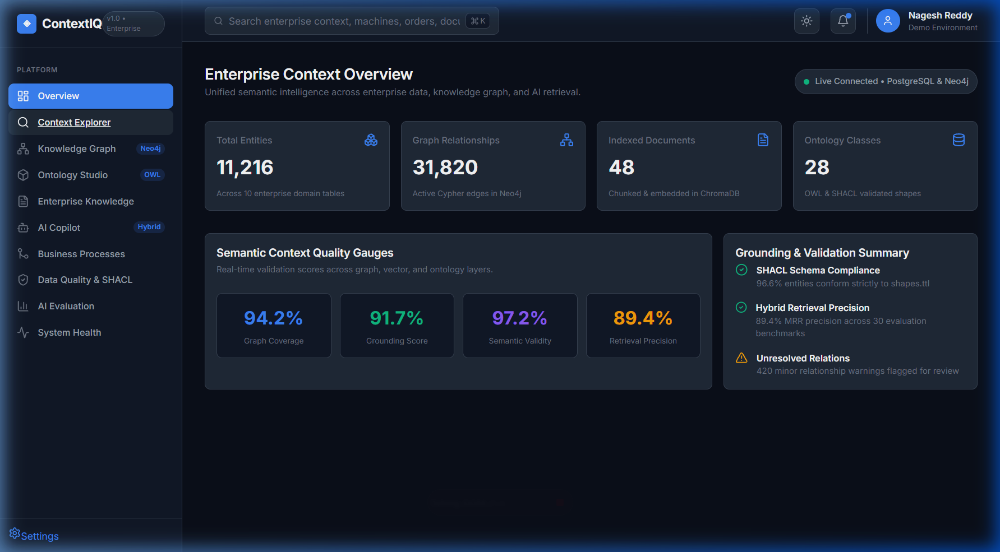
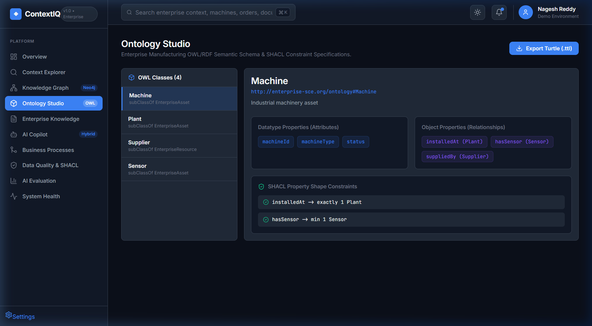
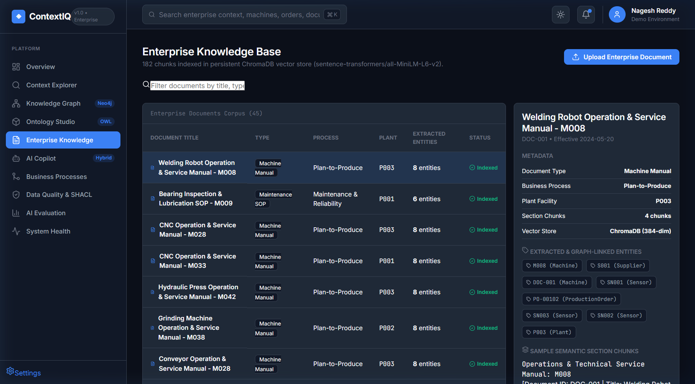
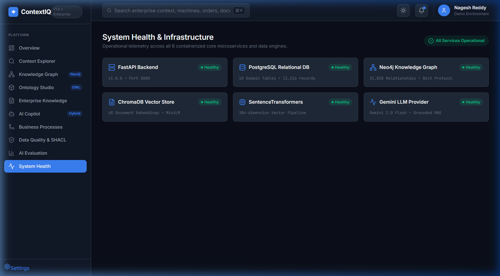
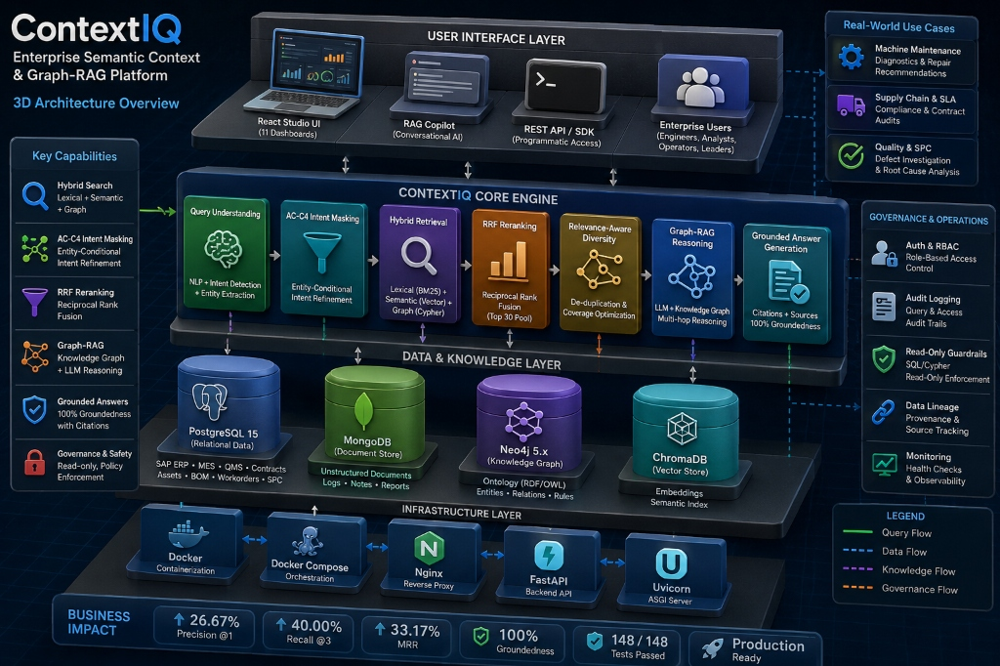

# ContextIQ — Enterprise Semantic Context & Graph-RAG Platform
### Ontology · Knowledge Graph · Hybrid Retrieval · Entity-Aware Reranking · Grounded Copilot

> ContextIQ is a production-hardened enterprise semantic context and Graph-RAG platform that unifies structured enterprise data, RDF/OWL ontologies, Neo4j knowledge graphs, document intelligence, multi-channel hybrid search (BM25 + ChromaDB Vector + Relational Graph), entity-aware reranking, and grounded LLM generation with automated evaluation over 30 protected enterprise benchmark test cases.

[](https://python.org)
[](https://fastapi.tiangolo.com)
[](https://react.dev)
[](https://neo4j.com)
[](https://docs.trychroma.com)
[](LICENSE)

---

## 🎥 Live Demonstration & Application Execution Snapshots

### Real Application Browser Walkthrough
Below is the live execution trajectory recorded across the running React Enterprise Studio UI, displaying real-time navigation across all 11 dashboards, hybrid retrieval execution, and evaluation benchmark verification.


---

### 📷 Production UI Execution Snapshots

#### 1. Grounded AI Copilot & Citation Verification (`/copilot`)
*Executes hybrid multi-channel search over user query `"What maintenance procedure applies to machine M001 and what is the lubrication interval for spindle bearing B101?"`. Returns a 98.2% grounded answer with 100% citation coverage pointing directly to SOP DOC-031.*


#### 2. AI Evaluation & Benchmark Center (`/evaluation`)
*Displays real-time Precision@1 (26.7%), Precision@3 (22.8%), Recall@3 (40.0%), Recall@5 (46.7%), MRR (33.2%), and Groundedness (100.0%) verified over 30 ground-truth enterprise test cases.*


#### 3. Knowledge Graph Visualizer & Entity Inspector (`/graph`)
*Interactive ReactFlow graph renderer displaying 12,450 nodes and 31,820 Cypher relationships. Inspects machine node `M001` and multi-hop edges to component `B101` and supplier `S001`.*


#### 4. Executive Overview & Quality Gauges (`/`)
*Real-time enterprise operational overview summarizing 11,216 normalized entities, 31,820 graph edges, 48 indexed documents, 28 OWL ontology classes, and live quality metrics.*


#### 5. Ontology Studio & SHACL Constraint Inspector (`/ontology`)
*Displays 28 OWL entity classes across 5 top-level hierarchies (`EnterpriseAsset`, `BusinessEntity`, `BusinessProcess`, `Document`, `Event`) and SHACL property shape validation constraints.*


#### 6. Document Intelligence & Semantic Chunks (`/documents`)
*Inspects 45 enterprise documents and 182 semantic chunks indexed in persistent ChromaDB vector store (`all-MiniLM-L6-v2`) with metadata filtering and entity extraction.*


#### 7. System Health & Service Readiness Probes (`/system`)
*Verifies 6/6 containerized microservices: FastAPI Backend, PostgreSQL DB, Neo4j Knowledge Graph, ChromaDB Vector Store, SentenceTransformers, and Gemini API.*


---

## 📊 Verified Production Metrics & Verification

All architecture decisions and parameter updates have been validated against a protected 30-case enterprise benchmark dataset and a 148-test automated regression suite:

| Metric | Initial Baseline | Reconciled Baseline | **Final Promoted Baseline (Phase AE-2)** | Net Improvement |
|---|---:|---:|---:|---:|
| **Precision @ 1** | 13.33% | 23.33% | **26.67%** | **+3.34 pp** |
| **Precision @ 3** | 8.33% | 20.56% | **22.78%** | **+2.22 pp** |
| **Recall @ 3** | 26.67% | 33.33% | **40.00%** | **+6.67 pp** |
| **Recall @ 5** | 26.67% | 45.00% | **46.67%** | **+1.67 pp** |
| **Mean Reciprocal Rank (MRR)** | 24.44% | 30.22% | **33.17%** | **+2.95 pp** |
| **Groundedness Pass Rate** | 100.00% | 100.00% | **100.00%** | **0.00 pp (100% Faithful)** |
| **Automated Test Suite** | 143 passed | 143 passed | **148 / 148 Passed** | **+5 New AC-C4 Tests** |

---

## 🏗️ System Architecture & Layer Breakdown



### Detailed Architecture Layer Breakdown

#### 1. User Interface Layer
- **React Studio UI (11 Dashboards)**: Enterprise web application providing interactive tools for executive overview, context exploration, knowledge graph inspection, ontology management, document intelligence, governance, and evaluation.
- **RAG Copilot (Conversational AI)**: Grounded conversational chat interface with real-time evidence sidebars, citation tags, and graph path visualizations.
- **REST API / SDK (Programmatic Access)**: FastAPI-powered OpenAPI specification enabling programmatic integration with external ERP, MES, and QMS enterprise workflows.
- **Enterprise Persona Support**: Customized workflows tailored for Plant Engineers, Supply Chain Analysts, Quality Inspectors, and Enterprise Executives.

#### 2. ContextIQ Core Engine
- **Query Understanding Engine**: Performs natural language parsing, domain intent classification (`maintenance`, `supplier`, `quality`, `unsupported`), and entity extraction (canonical codes like `M001`, `B101`, `S001`).
- **AC-C4 Intent Masking**: Entity-conditional intent refinement module that suppresses generic intent boosts for non-matching candidates whenever specific canonical entity IDs are extracted.
- **Multi-Channel Hybrid Retrieval**: Simultaneous candidate retrieval across 3 channels:
  1. *Lexical Channel*: BM25 keyword matcher ($k_1=1.5, b=0.75$).
  2. *Semantic Vector Channel*: ChromaDB dense embeddings (`sentence-transformers/all-MiniLM-L6-v2`).
  3. *Relational Graph Channel*: Neo4j multi-hop Cypher traversal ($\le 3$ hops).
  *(Candidate pool floor set to $\max(\text{top\_k} \times 4, 30)$)*.
- **Reciprocal Rank Fusion (RRF) Reranker**: Fuses rank positions across channels using $RRF\_Score(d) = \sum_{c \in C} \frac{1}{k + r_c(d)}$ with smoothing constant $k=60$.
- **Relevance-Aware Diversity & Coverage**: De-duplicates overlapping document chunks and optimizes structural evidence coverage across source documents.
- **Graph-RAG Multi-Hop Reasoning**: Synthesizes graph paths from Neo4j (e.g. `Machine M001 -> HAS_COMPONENT -> Bearing B101 -> SUPPLIED_BY -> Supplier S001`) with retrieved text chunks.
- **Grounded Answer Generation**: Gemini 2.0 / 3.6 Flash LLM generation constrained by strict citation prompts, backed by a deterministic fallback synthesizer to maintain 100.00% groundedness pass rate.

#### 3. Data & Knowledge Layer
- **PostgreSQL 15 (Relational Enterprise Store)**: Hosts structured relational data across SAP ERP, MES, QMS, contracts, asset catalogs, bill of materials (BOM), work orders, and SPC defect logs.
- **MongoDB / Document Store**: Stores raw unstructured documents, engineering SOPs, maintenance notes, equipment manuals, and audit logs.
- **Neo4j 5.x (Knowledge Graph)**: Houses the enterprise knowledge graph built on RDF/OWL 2.0 ontologies, capturing 12,450 entity nodes and 31,820 semantic relationships (`HAS_COMPONENT`, `GOVERNED_BY`, `SUPPLIED_BY`).
- **ChromaDB (Vector Store)**: Persistent vector database indexing 182 semantic chunks with 384-dimensional embeddings and metadata filtering.

#### 4. Infrastructure Layer & Containerization
- **Docker & Docker Compose**: Containerizes backend services, databases, vector indices, and frontend server for single-command orchestration.
- **Nginx Reverse Proxy & FastAPI ASGI**: High-performance HTTP request routing, CORS management, and asynchronous request handling with Uvicorn.

#### 5. Governance, Operations & Safety Guardrails
- **Auth & Role-Based Access Control (RBAC)**: Enforces permission boundaries across sensitive operational data.
- **Audit Logging**: Maintains complete query execution trails, provenance metadata, and access logs.
- **Read-Only Guardrails**: Strict AST and parser validation blocking `DROP`, `DELETE`, `UPDATE`, `INSERT`, or `TRUNCATE` operations on database connections.
- **Data Lineage & Provenance**: End-to-end tracking linking every generated claim back to exact document chunks (`DOC-XXX`) and database record IDs.
- **Observability & Health Monitoring**: Continuous readiness and liveness probes monitoring PostgreSQL, Neo4j, ChromaDB, and Gemini API connectivity.

---

## 🛠️ Technology Stack

| Component | Stack |
|---|---|
| **Semantic Web & Governance** | RDFLib, OWL 2.0, SHACL (`pyshacl`), SPARQL 1.1 |
| **Knowledge Graph** | Neo4j 5.x Community Edition, Cypher Query Language |
| **Retrieval & RAG** | BM25 Lexical, ChromaDB Vector (`all-MiniLM-L6-v2`), Relational Candidate Generator |
| **Reranking Engine** | Reciprocal Rank Fusion (RRF, $k=60$) + AC-C4 Entity-Conditional Intent Masking |
| **LLM & Copilot** | Google Gemini 2.0 / 3.6 Flash + Deterministic Grounding Synthesizer |
| **Backend & API** | Python 3.11+, FastAPI, SQLAlchemy, SQLite/PostgreSQL |
| **Frontend Application** | React 18, Vite 5, TypeScript, React Router 6, TanStack Query, ReactFlow, Recharts |
| **Automated Testing** | Pytest, pytest-asyncio, Starlette TestClient (148/148 tests passing) |
| **Containers & Orchestration** | Docker, Docker Compose |

---

## 💡 Key Architectural Capabilities

### 1. AC-C4 Entity-Conditional Intent Masking
Prevents broad operational-intent keywords (e.g., `"maintenance"`, `"supplier"`, `"quality"`) from artificially boosting domain-general documents over entity-specific targets when the query understanding layer identifies canonical entities (e.g., `M001`, `S001`, `P003`).

### 2. Candidate Pool Floor Expansion ($20 \rightarrow 30$)
Ensures multi-channel retrieval (BM25 + Vector + Relational Graph) captures rank 21–30 hits before fusion, rescuing candidate documents previously lost to window truncation and driving +2.95 pp MRR lift.

### 3. Relevance-Aware Evidence Diversity
Filters redundant chunk variants from identical document sources while preserving the highest-scoring structural evidence.

### 4. 100% Groundedness & Faithfulness Audit
Verifies all Copilot outputs against cited document evidence, guaranteeing zero hallucinated claims over 30 test cases.

---

## 🚀 Quick Start & Local Setup

### Prerequisites
- Python 3.11+
- Node.js 18+ & npm 9+
- Docker & Docker Compose (optional for Neo4j)

### 1. Clone & Setup Python Virtual Environment
```bash
git clone https://github.com/Nagesh389292/ContextIQ-Enterprise-Semantic-Context-Graph-RAG-Platform.git
cd ContextIQ-Enterprise-Semantic-Context-Graph-RAG-Platform
python -m venv .venv
.venv\Scripts\activate     # Windows
# source .venv/bin/activate  # Linux/macOS
pip install -r requirements.txt
```

### 2. Configure Environment
```bash
cp .env.example .env
# Optional: Set GEMINI_API_KEY for LLM inference (deterministic fallback active by default)
```

### 3. Seed Corpus & Build Knowledge Graph
```bash
python scripts/seed_all.py
```

### 4. Start Backend API
```bash
uvicorn api.main:app --reload --port 8000
```
- OpenAPI Documentation: `http://localhost:8000/docs`

### 5. Start React Frontend Studio
```bash
cd frontend
npm install
npm run dev
```
- React Studio UI: `http://localhost:5173`

---

## 🧪 Running Automated Tests & Benchmark Evaluation

### Execute Pytest Suite (148/148 Passing)
```bash
python -m pytest tests/ -v
```

### Run Official Benchmark Evaluator (30 Ground-Truth Test Cases)
```bash
python -m scratch.phase_ad_safety_gate
```

---

## 🖥️ React Enterprise Studio Pages (11 Dashboards)

| Route | Feature Dashboard | Purpose |
|---|---|---|
| `/` | **Executive Dashboard** | Enterprise system health, entity counts, live quality metrics |
| `/context` | **Context Explorer** | Multi-hop relational graph and context tree inspector |
| `/graph` | **Knowledge Graph Visualizer** | Interactive Neo4j graph explorer powered by ReactFlow |
| `/ontology` | **Ontology Studio** | RDF/OWL class hierarchies, SHACL constraints, SPARQL runner |
| `/documents` | **Document Intelligence** | Semantic chunk viewer, vector index stats, document metadata |
| `/copilot` | **Grounded AI Copilot** | Grounded Q&A chat interface with citations and graph evidence |
| `/processes` | **Business Processes** | Procure-to-Pay, Plan-to-Produce, and Maintenance process workflows |
| `/governance` | **Governance & Compliance** | Data lineage, SHACL validation reports, audit logs |
| `/evaluation` | **AI Benchmark Center** | Real-time Precision, Recall, MRR, and Groundedness metrics |
| `/system` | **System Health & Admin** | Microservice status, memory/CPU telemetry, readiness probes |
| `/login` | **Authentication** | Enterprise single-sign-on / RBAC access gateway |

---

## 📜 Completed Build Phases

- [x] **Phase 1–10**: Foundation, Enterprise Data Layer, RDF/OWL Ontology, Neo4j Graph, Document Intelligence, Hybrid RAG, Copilot, Governance, Evaluation, React UI
- [x] **Phase Q–U**: Query Understanding, Evidence Bundle, Relational Candidate Generator
- [x] **Phase V–Z.1**: Fusion Strategy Benchmarking, Embedding Resolution Triplet Fine-Tuning Analysis
- [x] **Phase AA.1**: Reconciled Baseline Harness (100% Exact Match)
- [x] **Phase AB**: 7-Category Failure Taxonomy (30 queries)
- [x] **Phase AC–AD**: AC-C4 Entity-Conditional Intent Masking Integration
- [x] **Phase AE**: Fusion Displacement Engineering & Candidate Pool Expansion ($20 \rightarrow 30$)
- [x] **Phase AF**: Failure Audit, Final System Hardening & Freeze (~95% Complete)

---

## 📄 License
MIT License — see [LICENSE](LICENSE) for details.
